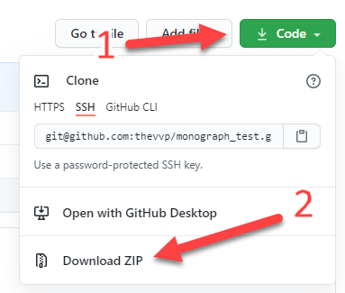
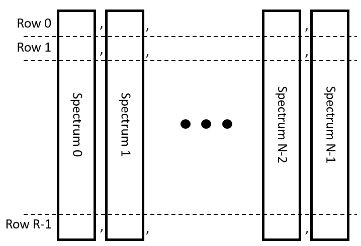
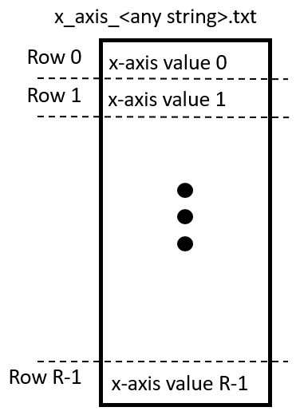
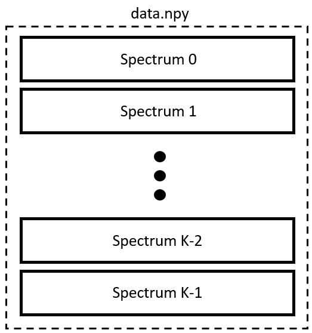
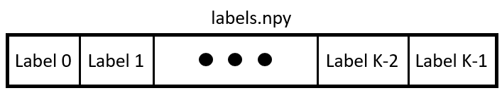
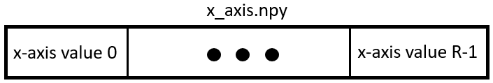

# Medical applications of laser molecular imaging and machine learning
## Yury V. Kistenev, Denis A. Vrazhnov, A. V. Borisov
  
This repository contains supplemental materials for the monograph "Medical applications of laser molecular imaging and machine learning". 
These materials are presented in the form of Python Jupyter notebooks, one notebook per procedure according to the chapter content. 
Chapter 3 contains informative feature extraction methods.
Chapter 4 contains clusterization and predictive model construction methods.
The name of notebook has following format: \<procedure tag\>_\<section\>.ipynb.
The complete list of tags and procedures is presented in the Introduction section of the monograph.

## Important!
To view the presented examples, we recommend using the **nbviewer** tool: https://nbviewer.jupyter.org/github/biophotonics-lab-tsu/monograph/

If you want to experiment with the presented code, you have 2 options:
- download this repository and use your execution environment to run code
- download this repository, download prepared execution environment built using jupyter notebook, and run this code

# How to download this code
### Cloning repository as zip archive

After you downloaded archive unpack it in any directory on your computer.  
Copy notebook (file with .ipynb extension) and directory *data* from this repository into *notebooks* directory inside environment directory.  
Run batch file *run_jupyter_lab.bat* from environment directory.  
Jupyter lab will open in your browser. Select desired notebook in the left side of the page.

# Where to download ready execution environment
Use one of the links below.  
At this moment environment supports **only** 32bit and 64bit versions of Windows 10.  
To unpack environment archive you should have installed 7z or WinRAR tool in your system

### Download execution environment from the following link
[Download environment (Win10)](https://drive.google.com/file/d/1kiq_l-r7EfCqmrfZKh_yAmi4dLfqbDKp/view?usp=sharing)  
Download environment (MacOS) - will be ready soon

# How to use your data with this code
Example programs expects data only in npy format.  
If you have data in txt format you can convert it to npy format using *Converter.ipynb* and after that all examples will use your converted data.  

## Format of txt files
All txt files should be placed in *txt_data* directory. Directory *txt_data* should be placed in the same directory as *Converter.ipynb* 
notebook. **One file contains all spectra of one class.** Converter expects txt files with next format. Each column of file contains one spectrum. 
Columns separated with comma sign *,*. Values are represented in E-notation. Scheme of txt file, containing N spectra where each spectrum contains 
R frequencies, shown below.  
### N - number of spectra of one class
### R - number of frequencies
  
  
To set x-axis values for all grapsh with spectral data, you can use x_axis_\<any string\>.txt file. It will be converted into *x_axis.npy* file.  
  

## Format of npy files
Program expects two files *data.npy* and *labels.npy* placed in *bin_data* directory. 
File *data.npy* is a two-dimensional array where each row contains one spectrum. Spectra of all classes 
placed in *data.npy* file. File *labels.npy* is a one-dimensional array contains labels for each spectrum in *data.npy*. 
Number of labels equals to number of spectra. So length of *labels* array equals to number of rows in *data.npy* matrix.  
### K - number of spectra of all classes
### R - number of frequencies
  
  
  